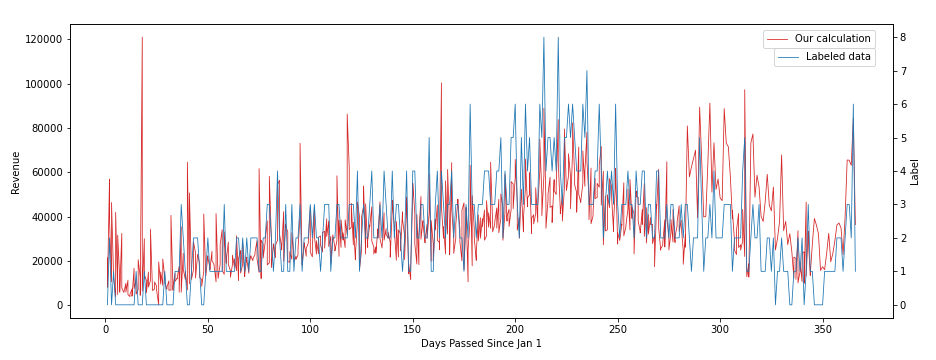
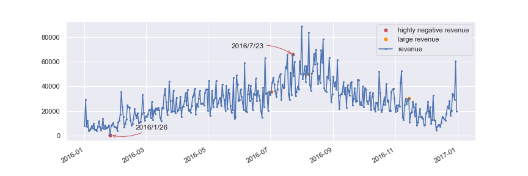

# Report

# What we have done
## Revenue Formula Derivation
We tried several formulas for the revenue calculation. First, we tried `'Non refund' x reservation_status_date` and `ADR x (week nights + weekend nights)` to include the bookings that has their deposit already paid upon reservation. However, we get the following chart after matching it with the labeled revenue data. The red line is our output while the blue line is the labeled data.

Then, we obtained a better result when using `ADR x (week nights + weekend nights)` as follows:

It seems that the outcome of this formula perfectly fits the data. We also write a program to find the actual boudary. The result shows that the numerical boudaries of the labels are 10000, 20000 , and so on. Therefore, we can transform the original ordinal classification problem to a regression problem without loss of generality. This will make the task more easier since there are many algorithms and models designed for regression problems.

## Detection/Dropping of Outliner
### Abnormal ADR
When observing the ADR of each order, we found that there are some datas with abnormal ADR values. First, all the values of ADR are within the range from -200 to 500, except one data with an ADR value of nearly 5400, which is very likely an outliner that may influence the prediction of ADR. Therefore, we decided to remove this data. On the other hand, we note that some orders have extremly negative ADR, which may make the daily revenue drop dramatically. To confirm this, we plot the daily revenue diagram and mark the dates with this property:

As we can see from the diagram above, the revenue in 2016/1/26 decreased to nearly zero just because of the single abnormal order! Moreover, we also marked the date of the orders with extremly high revenue (more than 3000), see the orange dots in the figure above. As a result, these orders don't cause any obvious jump. Therefore, we decide to remove the order with extremly negative ADR from the training data.