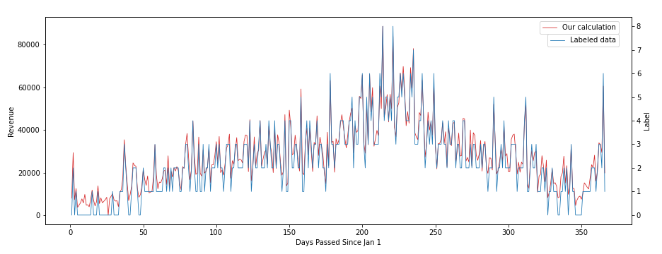

# Report

# What we have done

## Revenue Formula Derivation

We tried several formulas for the revenue calculation. First, we tried `'Non refund' x reservation_status_date` and `ADR x (week nights + weekend nights)` to include the bookings that has their deposit already paid upon reservation. However, we get the following chart after matching it with the labeled revenue data. The red line is our output while the blue line is the labeled data.

Then, we obtained a better result when using `ADR x (week nights + weekend nights)` as follows:

It seems that the outcome of this formula perfectly fits the data. We also write a program to find the actual boundary. The result shows that the numerical boundaries of the labels are 10000, 20000 , and so on. Therefore, we can transform the original ordinal classification problem to a regression problem without loss of generality. This will make the task more easier since there are many algorithms and models designed for regression problems.

## Detection/Dropping of Outlier

### Abnormal ADR

When observing the ADR of each order, we found that there are some data with abnormal ADR values. First, all the values of ADR are within the range from -200 to 500, except one data with an ADR value of nearly 5400, which is very likely to be an outlier that may influence the prediction of ADR. Therefore, we decided to remove this data. On the other hand, we note that some orders have extremely negative ADR, which may make the daily revenue drop dramatically. To confirm this, we plot the daily revenue diagram and mark the dates with this property:

As we can see from the diagram above, the revenue in 2016/1/26 decreased to nearly zero just because of the single abnormal order. Moreover, we also marked the date of the orders with extremely high revenue (more than 3000), see the orange dots in the figure above. As a result, these orders don't cause any obvious jump. Therefore, we decide to remove the order with extremely negative ADR from the training data.

## Model Building and Evaluation

After discussion, we came up with two main ideas for the framework of model. First, an intuitive way to train the models and make prediction is to treat each order as single input data. In this way, we can convert the original ordinal ranking problem to two subproblems: a regression problem (i.e., predict the correct ADR value for each order) and a traditional binary classification problem (i.e., predict if an order is canceled or not). These two problems are what we are familiar to in this course; therefore, we can utilize the algorithms such as perceptron learning algorithm, support vector machine, etc. Moreover, since both of these two problems are well-known machine learning problem, there are many existing well-developed algorithms that solve two problems for us to explore. Based on the above reasons, it's a possibly method to be implemented and analyzed.
However, the framework we mentioned above has a possible drawback: it focuses on predicting every order's ADR and whether it's canceled without considering other orders in the same day as a whole. When using the ADR and `is_canceled` predicted by model to compute the total daily revenue, we just summing up each single revenue. This means that we may lose some information of the whole day. For this reason, we considered another approach as a possible solution: predict the daily revenue using the information of the whole day. There are several methods to do handle this problem. For example, we use seq2seq, which is a architecture of recurrent neural network, to predict the daily revenue based on previous daily revenue and some other information.

### Seq2Seq

### Random Forest

We performed grid search for the random forest model and obtained the best parameters. The accuracy score for 5-fold cross validation is ~0.84. Total training time is 1.6 minutes.

### Neural Network

### Support Vector Regression

To predict ADR, we tried the SVR package from sklearn. The default model gives us a mean squared error of 1244, and it took 5 minutes to do the 3-fold cross validation as shown in the below screenshot.

Then, we perform parameter optimization using grid search with the `GridSearchCV` function in sklearn.
However, we set the parameter space to 144 combinations and 5 fold cross validation and made the searching time so long that we have to terminate it (estimated time: ~4 days).

Thus, we used `RandomizedSearchCV` instead to cap the maximum parameter combinations to 100. With 3-fold cross validation, the total search time was reduced to 682.3 minutes. The best model gave us a mean squared error of 928.31.

The parameter space that we searched:

### XGBoost Regression

We then tried the default XGBoost regression model and obtained the following result. Both the training time and MSE are better than the default support vector regression model.

And the MSE of the best parameter is 770:

I then tried two feature selection algorithm, one is sklearn's `SelectFromModel`, and the other is `PCA`. However, both didn't give a better result than using the original feature set. It is obvious that the MSE becomes higher as the number of feature decreases.

### LightGBM Regression

We also tried the default LightGBM regression model which gave us an even better result:

And the MSE of the best parameter is 788:

### Classification

We tried random forest, XGBoost, and LightGBM and found that the base model of LightGBM gave us the best AUC score of ~0.866. We then tried randomized search to tune the hyperparameter. However, the search didn't give us a better model. The parameter space we searched for and the results are shown below.

Result for the base model:

Result after tuning the parameters:

